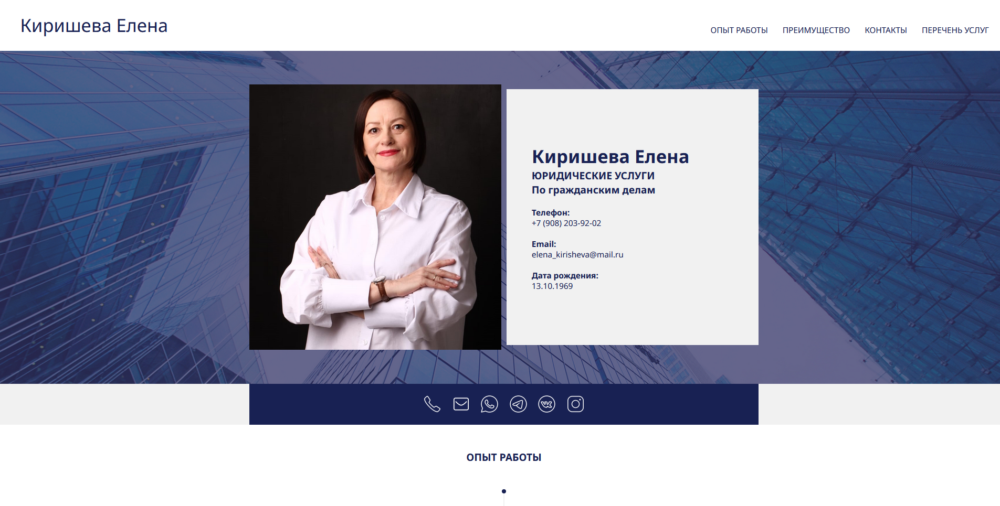

# https://lawyerkirisheva.ru

#### Вёрстка построена на модульных блоках с использованием CSS и JS-подходов, полностью адаптивна и поддерживает интерактивность без сторонних библиотек.

  
  
  
  
  

### Основные модули (блоки) вёрстки
##### Header (шапка)
- Логотип (имя).
- Горизонтальное меню навигации (для больших экранов).
- Бургер-меню и мобильное меню (для малых экранов).
##### Главный блок (Hero)
- Фото и информация о специалисте.
- Контактные данные.
- Социальные иконки.
##### Секции:
- ОПЫТ РАБОТЫ (`#experience`) — таймлайн с годами и описанием.
- ПЕРЕЧЕНЬ УСЛУГ (`#services`) — список услуг в двух колонках.
- ПРЕИМУЩЕСТВА (`#advantage`) — преимущества с иконками.
- КОНТАКТЫ (`#contacts`) — форма обратной связи и контакты.
##### Footer (подвал)
- Копирайт с текущим годом.

### Основные CSS-модули и классы
- :root — CSS-переменные для цветов, размеров, шрифтов.
- .header_left, .header_right, .logo, .navigation — стилизация шапки и меню.
- .hamburger, .mobile_menu — стили для мобильного меню.
- .photo, .boxphoto, .text — главный блок с фото и текстом.
- .social, .socialm, .icon — блоки иконок соцсетей.
- .whitebox, .whitebox1, .whitebox2 — универсальные контейнеры для секций.
- .connection, .contact-form, .button, .buttonok — стили для формы обратной связи.
- .blue-circle, .line, .linegrey, .linewhite — декоративные элементы.
- Медиа-запросы — адаптивность под разные экраны.

### JavaScript (js/basic.js)
- Меню:
- Открытие/закрытие мобильного меню по клику на бургер.
- Закрытие меню при клике вне меню.
- Переключение классов для анимации бургера.
- Скролл:
- Плавная прокрутка к нужной секции по клику на пункт меню (с учётом смещения).
- Форма:
- Сброс формы при загрузке страницы.
- Валидация полей формы (имя, email, телефон, сообщение).
- Отображение ошибок или успешной отправки (без реального отправления данных).
- После отправки скрывает поля и меняет кнопку.
- Автоматически подставляет текущий год и считает стаж.

### Адаптивность
- Используются CSS-переменные для размеров.
- Медиа-запросы для разных ширин экрана: перестройка колонок, изменение размеров шрифтов, скрытие/отображение элементов (например, бургер-меню появляется на малых экранах).

### Как работает

- Навигация: при клике на пункты меню страница плавно прокручивается к нужной секции.
- Мобильное меню: появляется при малой ширине экрана, открывается по клику на бургер.
- Форма: проверяет заполненность полей, показывает ошибки, имитирует отправку.
- Контакты и соцсети: кликабельные иконки для связи.
- Декоративные элементы: линии, круги, фоновые изображения для визуального оформления.
